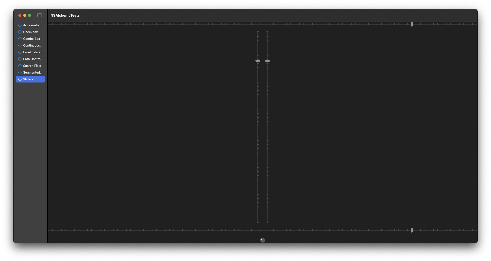
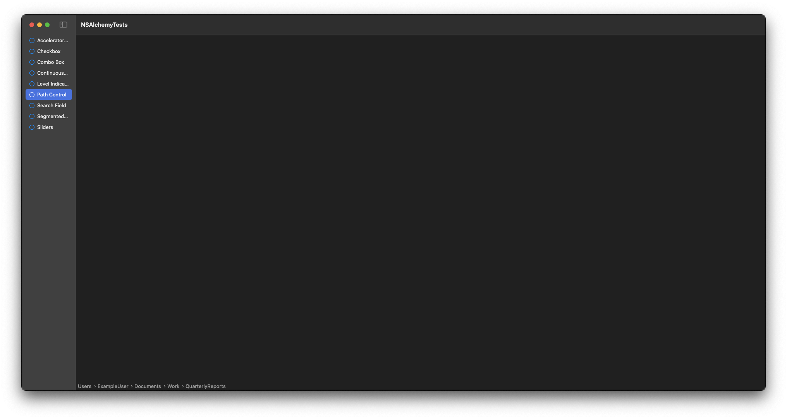
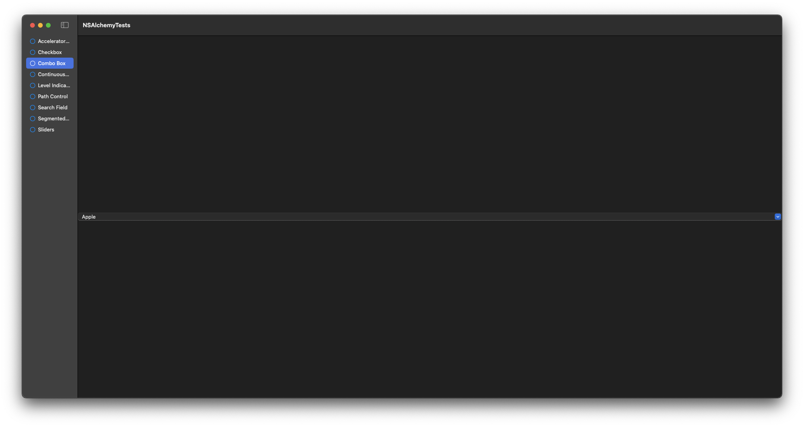
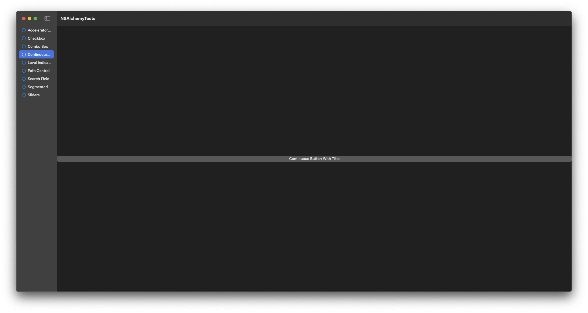

# NSAlchemy
## A Package of Useful macOS Controls for SwiftUI

### What is NSAlchemy?

NSAlchemy is a Swift package that contains SwiftUI views from AppKit that SwiftUI doesn't support out of the box, or implementations of views that SwiftUI does natively support, but aren't as customizable.
As of April 25, 2025, the package contains the following views:
- HSlider: A horizontal slider with various customization options including tick marks and the ability to change the track color.
- VSlider: A vertical slider that has the same customization options as HSlider, but is oriented vertically.
- CircularSlider: A Circular slider that has a few options to customize it, but not as much as the previous mentioned ones. This slider acts much more like a knob.
- LevelIndicator: A view that can reflect capacity levels or ratings. This view contains many customizations, including the ability to change the colors for warning and critical levels for the capacity style indicator and the ability to use custom assets for the rating images.
- PathControl: A simple view that displays a visual representation of the path to a file.
- ComboBox: A view that combines a text field and a pulldown list for selection between multiple options.
- Checkbox: Though SwiftUI supports checkboxes natively, this one supports on, off and mixed states.
- AcceleratorButton: Pressure-sensitive buttons that increase the frequency an action is executed the more pressure is applied.
- ContinuousButton: A button that executes it's action after an optional delay and then at a provided interval
- SearchField: Though SwiftUI has the searchable modifier, it lacks a dedicated search field
- SegmentedControl: Though SwiftUI supports segmented controls through a picker style, it's not very customizable and it doesn't support multiple selections like this one does.

# Installation Instructions

To install this package, you must use Swift Package Manager (SPM).

1. When you are in an Xcode project, go to File > Add Package Dependencies
2. Enter the URL https://www.github.com/JJRoot822/NSAlchemy
3. Hit enter and select NSAlchemy from the results.
4. Press Add Package, and then press Add Package again.

### Slider Examples

```swift
struct SlidersView: View {
	@State private var volume = Double(Int.random(in: 0...100))
	
	var body: some View {
		VStack(spacing: 20) {
			HSlider("Volume Level", value: $volume, min: 0, max: 100, altStep: 5, allowsTickMarks: true)
				.trackColor(.systemYellow)
				.tickMarks(number: 100, stepByTicks: true, position: .above)
			
			HStack(spacing: 20) {
				VSlider("Volume Level", value: $volume, min: 0, max: 100, altStep: 5, allowsTickMarks: true)
					.trackColor(.systemGreen)
					.tickMarks(number: 50, stepByTicks: false, position: .leading)
				
				VSlider("Volume Level", value: $volume, min: 0, max: 100, altStep: 5, allowsTickMarks: true)
					.trackColor(.systemRed)
					.tickMarks(number: 50, stepByTicks: false, position: .trailing)
			}
			
			HSlider("Volume Level", value: $volume, min: 0, max: 100, altStep: 5, allowsTickMarks: true)
				.trackColor(.systemOrange)
				.tickMarks(number: 100, stepByTicks: true, position: .below)
			
			CircularSlider("Volume Level", value: $volume, min: 0, max: 100, altStep: 5, allowTickMarks: false)
		}
	}
}
```



### Level Indicator Examples

```swift
import SwiftUI
import NSAlchemy

struct LevelIndicatorsView: View {
	let maxStorageInPB: Double = 1.0
	let percentageUsed: Double = 0.25
	
	var usedStorageString: String {
		return numberFormatter.string(from: NSNumber(value: maxStorageInPB * percentageUsed))!
	}
	
	var maxStorageString: String {
		return numberFormatter.string(from: NSNumber(value: maxStorageInPB))!
	}
	
	var body: some View {
		VStack(spacing: 20) {
			VStack(spacing: 5) {
				Text("\(usedStorageString)) PB out of \(maxStorageString) PB")
				
				LevelIndicator("Storage", value: convertToGigabytes(petabytes: maxStorageInPB) * percentageUsed, minValue: 0, maxValue: convertToGigabytes(petabytes: maxStorageInPB))
					.indicatorStyle(.continuousCapacity)
					.indicatorFill(color: .green)
					.indicatorWarning(fraction: 0.5, color: .yellow)
					.indicatorCritical(fraction: 0.80, color: .red)
			}
			
			VStack(spacing: 5) {
				Text("Volume: 75%")
				
				LevelIndicator("Volume", value: 0.75, minValue: 0, maxValue: 1.0)
					.indicatorStyle(.discreteCapacity)
					.indicatorFill(color: .green)
					.indicatorWarning(fraction: 0.70, color: .yellow)
					.indicatorCritical(value: 0.80, color: .red)
			}
			
			VStack(spacing: 5) {
				Text("Star Wars: The Acolyte")
				
				LevelIndicator("Media Rating", value: 1, minValue: 0, maxValue: 5, ratingImageSymbol: "star.fill", ratingPlaceholderImageSymbol: "star", placeholderVisibility: .always)
					.indicatorStyle(.rating)
					.indicatorFill(color: .yellow)
			}
		}
	}
	
	private var numberFormatter: NumberFormatter = {
		let formatter = NumberFormatter()
		formatter.numberStyle = .decimal
		formatter.minimumFractionDigits = 0
		formatter.maximumFractionDigits = 2
		
		return formatter
	}()
	
	private func convertToGigabytes(petabytes: Double) -> Double {
		// number of PB * 1024 TB per PB * 1024 GB per TB
		return petabytes * 1024 * 1024
	}
}
```


### PathControl Example

```swift
import SwiftUI
import NSAlchemy

struct PathControlView: View {
	private let url = URL(string: "/Users/ExampleUser/Documents/Work/QuarterlyReports")!
	
	var body: some View {
		VStack {
			Spacer()
			
			PathControl(url: url)
		}
	}
}
```



### ComboBox Example

```swift
import SwiftUI
import NSAlchemy

struct ComboBoxView: View {
	@State private var selection: String = "Apple"
	
	private let companies = [
		"Facebook", "Apple", "Amazon",
		"Netflix", "Google", "Microsoft",
		"Oracle", "Intel", "AMD",
		"NVIDIA", "Asus", "Lenovo",
		"HP", "Acer", "Dell",
		"MSI", "Gigabyte", "Toshiba"
	]
	
	var body: some View {
		ComboBox(label: "Technology Companies", selection: $selection, hasScroller: true, completes: true, items: companies)
			.visibleItems(3)
	}
}
```



### AcceleratorButton Example

```swift
struct AcceleratorButtonsView: View {
	var body: some View {
		VStack(spacing: 20) {
			AcceleratorButton("Accelerator Button with Title") { pressure in
				print(pressure)
			}
			
			AcceleratorButton("Multi-level Accelerator Button with Title", levels: 2) { pressure in
				print(pressure)
			}
			
			AcceleratorButton("Accelerator Button with SFSymbol", systemImage: "mappin") { pressure in
				print(pressure)
			}
			
			AcceleratorButton("Multi-level Accelerator Button with SF Symbol", systemImage: "mappin", levels: 2) { pressure in
				print(pressure)
			}
			
			AcceleratorButton("Accelerator Button with Only SFSymbol", systemImage: "mappin") { pressure in
				print(pressure)
			}
			.buttonContentStyle(.iconOnly)
			
			AcceleratorButton("Multi-level Accelerator Button With Only SF Symbol", systemImage: "mappin", levels: 2) { pressure in
				print(pressure)
			}
			.buttonContentStyle(.iconOnly)
		}
	}
}

```


### Checkbox Example

```swift
struct CheckboxesView: View {
	@State private var checkedStateOff = CheckboxState.off
	@State private var checkedStateOn = CheckboxState.on
	@State private var checkedStateMixed = CheckboxState.mixed
	
	var body: some View {
		VStack(spacing: 20) {
			Checkbox("Unchecked", state: $checkedStateOff, allowsMixed: true)
			Checkbox("Checked", state: $checkedStateOn, allowsMixed: true)
			Checkbox("Mixed", state: $checkedStateMixed, allowsMixed: true)
		}
	}
}
```


### ContinuousButton Example

```swift
struct ContinuousButtonView: View {
	var body: some View {
		ContinuousButton("Continuous Button With Title", delay: 2, interval: 0.5) {
			print("Hello, World")
		}
	}
}
```



### SegmentedControl Example

```swift
struct SegmentedControlsView: View {
	@State private var clothingSize = Set<SegmentedControlItem>()
	@State private var flavors = Set<SegmentedControlItem>()
	@State private var toyShapes = Set<SegmentedControlItem>()
	
	var body: some View {
		VStack(spacing: 20) {
			SegmentedControl("Clothing Size", selection: $clothingSize, items: [
				SegmentedControlItem(title: "Small", tag: 1),
				SegmentedControlItem(title: "Medium", tag: 2),
				SegmentedControlItem(title: "Large", tag: 3),
				SegmentedControlItem(title: "Extra Large", tag: 4),
				SegmentedControlItem(title: "2XL", tag: 5),
				SegmentedControlItem(title: "3XL", tag: 6),
				SegmentedControlItem(title: "4XL", tag: 7),
				SegmentedControlItem(title: "5XL", tag: 8)
			], selectionMode: .one, segmentContentStyle: .title)
			.segmentedControlStyle(.separated)
			.segmentDistribution(.fillEqually)
			.selectedSegmentColor(.accentColor)
			
			SegmentedControl("Ice Cream Flavors", selection: $flavors, items: [
				SegmentedControlItem(title: "Vanilla", tag: 1),
				SegmentedControlItem(title: "Chocolate", tag: 2),
				SegmentedControlItem(title: "Strawberry", tag: 3)
			], selectionMode: .multiple, segmentContentStyle: .title)
			.segmentedControlStyle(.automatic)
			.segmentDistribution(.fillEqually)
			.selectedSegmentColor(.accentColor)
			
			SegmentedControl("Toy Shapes", selection: $toyShapes, items: [
				SegmentedControlItem(title: "Circle", image: "circle.fill", tag: 1),
				SegmentedControlItem(title: "Square", image: "square.fill", tag: 2),
				SegmentedControlItem(title: "Rectangle", image: "rectangle.fill", tag: 3),
				SegmentedControlItem(title: "Squircle", image: "app.fill", tag: 4),
				SegmentedControlItem(title: "Capsule", image: "capsule.fill", tag: 5),
				SegmentedControlItem(title: "Oval", image: "oval.fill", tag: 6),
				SegmentedControlItem(title: "Triangle", image: "triangleshape.fill", tag: 7),
				SegmentedControlItem(title: "Diamond", image: "diamond.fill", tag: 8),
				SegmentedControlItem(title: "Octagon", image: "octagon.fill", tag: 9),
				SegmentedControlItem(title: "Hexagon", image: "hexagon.fill", tag: 10),
				SegmentedControlItem(title: "Pentagon", image: "pentagon.fill", tag: 11)
			], selectionMode: .multiple, segmentContentStyle: .symbolImage)
			.segmentedControlStyle(.automatic)
			.segmentDistribution(.fit)
			.selectedSegmentColor(.accentColor)
		}
	}
}
```


### SearchField Example

```swift
struct Movie: Identifiable {
	let id = UUID()
	
	var title: String
	var releaseDate: Date
	var releaseDateString: String
	var director: String
	
	init(title: String, releaseDate: Date, director: String) {
		self.title = title
		self.director = director
		self.releaseDate = releaseDate
		self.releaseDateString = dateFormatter.string(from: releaseDate)
	}
	
	private var dateFormatter: DateFormatter = {
		let formatter = DateFormatter()
		formatter.dateStyle = .full
		formatter.timeStyle = .none
		
		return formatter
	}()
}

struct SearchFieldView: View {
	@State private var searchTerm: String = ""
	
	private let movies: [Movie] = [
			Movie(title: "Star Wars: Episode IV – A New Hope", releaseDate: Calendar.current.date(from: DateComponents(year: 1977, month: 5, day: 25))!, director: "George Lucas"),
			Movie(title: "Star Wars: Episode V – The Empire Strikes Back", releaseDate: Calendar.current.date(from: DateComponents(year: 1980, month: 5, day: 21))!, director: "Irvin Kershner"),
			Movie(title: "Star Wars: Episode VI – Return of the Jedi", releaseDate: Calendar.current.date(from: DateComponents(year: 1983, month: 5, day: 25))!, director: "Richard Marquand"),
			Movie(title: "Star Wars: Episode I – The Phantom Menace", releaseDate: Calendar.current.date(from: DateComponents(year: 1999, month: 5, day: 19))!, director: "George Lucas"),
			Movie(title: "Star Wars: Episode II – Attack of the Clones", releaseDate: Calendar.current.date(from: DateComponents(year: 2002, month: 5, day: 16))!, director: "George Lucas"),
			Movie(title: "Star Wars: Episode III – Revenge of the Sith", releaseDate: Calendar.current.date(from: DateComponents(year: 2005, month: 5, day: 19))!, director: "George Lucas"),
			Movie(title: "Star Wars: Episode VII – The Force Awakens", releaseDate: Calendar.current.date(from: DateComponents(year: 2015, month: 12, day: 18))!, director: "J.J. Abrams"),
			Movie(title: "Star Wars: Episode VIII – The Last Jedi", releaseDate: Calendar.current.date(from: DateComponents(year: 2017, month: 12, day: 15))!, director: "Rian Johnson"),
			Movie(title: "Star Wars: Episode IX – The Rise of Skywalker", releaseDate: Calendar.current.date(from: DateComponents(year: 2019, month: 12, day: 20))!, director: "J.J. Abrams"),
			Movie(title: "Rogue One: A Star Wars Story", releaseDate: Calendar.current.date(from: DateComponents(year: 2016, month: 12, day: 16))!, director: "Gareth Edwards"),
			Movie(title: "Solo: A Star Wars Story", releaseDate: Calendar.current.date(from: DateComponents(year: 2018, month: 5, day: 25))!, director: "Ron Howard")
	]
	
	var filteredMovies: [Movie] {
		guard !searchTerm.isEmpty else {
			return movies
		}
		
		return movies.filter { $0.title.localizedStandardContains(searchTerm) }
	}
	
	var body: some View {
		VStack(spacing: 20) {
			SearchField(text: $searchTerm, prompt: "Search for a Movie", maxRecents: 0)
				.sendSearchOnReturn()
		
			Table(filteredMovies) {
				TableColumn("Title", value: \.title)
				TableColumn("Director", value: \.director)
				TableColumn("Release Date", value: \.releaseDateString)
			}
		}
	}
}
```

